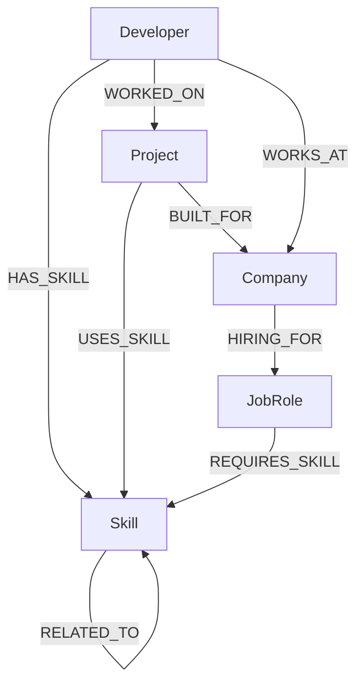

# SkillGraph

**SkillGraph — Developer Skill & Career Relationship Explorer**

SkillGraph is a full-stack web application built for the **Wexa AI Take-Home Assignment**. It explores complex, interconnected relationships between Developers, Skills, Projects, Companies, and Job Roles using **CognoDB** (a managed graph database with openCypher over Bolt protocol support).

---

## Why a Graph Database?

Traditional relational databases excel at structured tabular records but struggle with deeply interconnected networks. Exploring career skill gaps, multi-hop skill paths, or indirect recommendations requires joining multiple tables (`developers`, `developer_skills`, `skills`, `skill_relations`, `job_roles`, `job_role_skills`):

> *"Which skills are organically related (1-2 hops) to a developer's current skill set, and are also required by their target job role?"*

In a relational database, this requires complex SQL queries with 5+ `JOIN` operations and recursive subqueries that are slow to execute and difficult to maintain.

In a Graph Database, relationships are first-class entities. We simply traverse the graph index-free:

```cypher
(Developer)-[:HAS_SKILL]->(Skill)-[:RELATED_TO*1..2]-(Skill)<-[:REQUIRES_SKILL]-(JobRole)
```

This naturally mirrors human career paths and technical skill networks, yielding sub-millisecond query performance and an intuitive mental model.

---

## Technical Stack & Architecture

### Backend
- **Runtime**: Node.js & Express
- **Language**: TypeScript (`tsx` execution engine)
- **Database Layer**: CognoDB Cloud via official `neo4j-driver` (Bolt 5.x protocol)
- **API Design**: Parameterized REST endpoints under `/api`

### Frontend
- **Framework**: React 19 + TypeScript
- **Tooling**: Vite 6
- **Styling**: Tailwind CSS v4
- **State Management & Data Fetching**: TanStack React Query v5
- **Routing**: React Router v7
- **UI Components & Icons**: Lucide React & Framer Motion

```text
React 19 (TypeScript + Vite)
            ↓ REST API
      Express Backend
            ↓ Neo4j Driver (Bolt+s Protocol)
      CognoDB (Graph Database)
```

---

## Data Model

The graph schema consists of 5 main node labels and 8 relationship types:



### Node Schema
- `Developer`: `{ id, name, experience_years, location, bio }`
- `Skill`: `{ id, name, category, description }`
- `Project`: `{ id, name, description, difficulty, year }`
- `Company`: `{ id, name, industry, location }`
- `JobRole`: `{ id, title, description, level }`

### Relationship Schema
- `(Developer)-[:HAS_SKILL {proficiency, years}]->(Skill)`
- `(Developer)-[:WORKED_ON {role}]->(Project)`
- `(Developer)-[:WORKS_AT]->(Company)`
- `(Project)-[:USES_SKILL]->(Skill)`
- `(Project)-[:BUILT_FOR]->(Company)`
- `(Skill)-[:RELATED_TO]->(Skill)`
- `(JobRole)-[:REQUIRES_SKILL]->(Skill)`
- `(Company)-[:HIRING_FOR]->(JobRole)`

---

## Key Cypher Queries

- **Developer Skill Set (Query 1)**:
  ```cypher
  MATCH (d:Developer {id: $id})-[r:HAS_SKILL]->(s:Skill)
  RETURN s, r.proficiency AS proficiency, r.years AS years
  ```

- **Projects Using Skill (Query 2)**:
  ```cypher
  MATCH (p:Project)-[:USES_SKILL]->(s:Skill {id: $id})
  RETURN p
  ```

- **Graph Explorer Traversal (Query 3)**:
  ```cypher
  MATCH (n {id: $entityId})-[r]-(m)
  RETURN n, r, m
  ```

- **Skill Recommendations (Query 4)**:
  ```cypher
  MATCH (d:Developer {id: $id})-[:HAS_SKILL]->(known:Skill)-[:RELATED_TO]-(recommended:Skill)
  WHERE NOT (d)-[:HAS_SKILL]->(recommended)
  WITH recommended, count(known) AS connectionStrength, collect(known.name) AS relatedKnownSkills
  ORDER BY connectionStrength DESC
  RETURN recommended, connectionStrength, relatedKnownSkills
  ```

- **Similar Developers (Query 5)**:
  ```cypher
  MATCH (d:Developer {id: $id})-[:HAS_SKILL]->(s:Skill)
  MATCH (other:Developer)-[:HAS_SKILL]->(s)
  WHERE d <> other
  WITH other, count(s) AS sharedSkills, collect(s.name) AS sharedSkillNames
  ORDER BY sharedSkills DESC
  RETURN other, sharedSkills, sharedSkillNames
  ```

- **Career Learning Path (Query 6 - Multi-hop)**:
  ```cypher
  MATCH (d:Developer {id: $developerId})
  MATCH (j:JobRole {id: $jobRoleId})
  MATCH (j)-[:REQUIRES_SKILL]->(required:Skill)
  WHERE NOT (d)-[:HAS_SKILL]->(required)
  OPTIONAL MATCH (d)-[:HAS_SKILL]->(known:Skill)-[:RELATED_TO]-(required)
  WITH required, collect(known) AS connectedKnownSkills
  RETURN required, connectedKnownSkills
  ```

- **Indirect Useful Skill Discovery (Query 7 - Relational Awkward Query)**:
  ```cypher
  MATCH (d:Developer {id: $id})-[:HAS_SKILL]->(known:Skill)
  MATCH (known)-[:RELATED_TO*1..2]-(indirect:Skill)
  WHERE NOT (d)-[:HAS_SKILL]->(indirect)
  MATCH (indirect)<-[:REQUIRES_SKILL]-(j:JobRole)
  WITH indirect, collect(DISTINCT j.title) AS usefulForRoles, count(DISTINCT known) AS pathCount
  ORDER BY pathCount DESC
  RETURN indirect, usefulForRoles, pathCount
  ```

---

## Setup & CognoDB Cloud Provisioning

### 1. Provision CognoDB Instance
1. Register at [https://console.cognodb.com/signup](https://console.cognodb.com/signup).
2. Provision a free `c0` instance in your preferred region.
3. Save the connection details (`bolt+s://<instance-id>.databases.cognodb.com` and password for user `cognodb`).

### 2. Configure Environment Variables
Copy `.env.example` to `.env` and fill in your CognoDB instance credentials:

```env
COGNODB_URI=bolt+s://<instance-id>.databases.cognodb.com
COGNODB_USERNAME=cognodb
COGNODB_PASSWORD=<your_saved_password>
```

### 3. Install Dependencies & Seed Database
```bash
npm install
npm run seed
```

### 4. Run Development Server
```bash
npm run dev
```
Access the application at `http://localhost:3000`.

---

## Production Build & Execution

To compile the Vite SPA frontend and Express Node.js backend for production:

```bash
npm run build
npm run start
```
