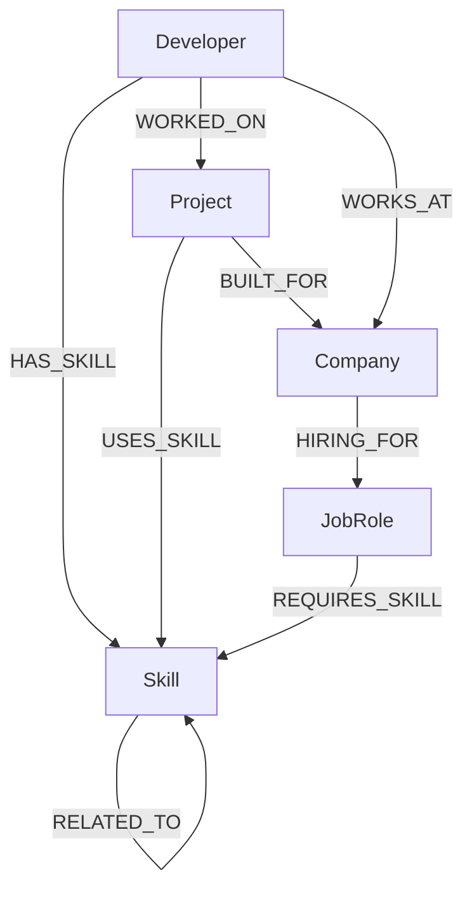

# SkillGraph Data Model

## Nodes

- **Developer:** represents a person (name, experience_years, location, bio).
- **Skill:** represents a technology or tool (name, category, description).
- **Project:** represents software built (name, description, difficulty, year).
- **Company:** represents an employer (name, industry, location).
- **JobRole:** represents a position (title, description, level).

## Relationships

- **HAS_SKILL:** Connects Developer -> Skill. Includes properties `proficiency` and `years`.
- **WORKED_ON:** Connects Developer -> Project. Includes property `role`.
- **WORKS_AT:** Connects Developer -> Company.
- **USES_SKILL:** Connects Project -> Skill.
- **BUILT_FOR:** Connects Project -> Company.
- **RELATED_TO:** Connects Skill -> Skill (e.g. React -> TypeScript).
- **REQUIRES_SKILL:** Connects JobRole -> Skill.
- **HIRING_FOR:** Connects Company -> JobRole.
